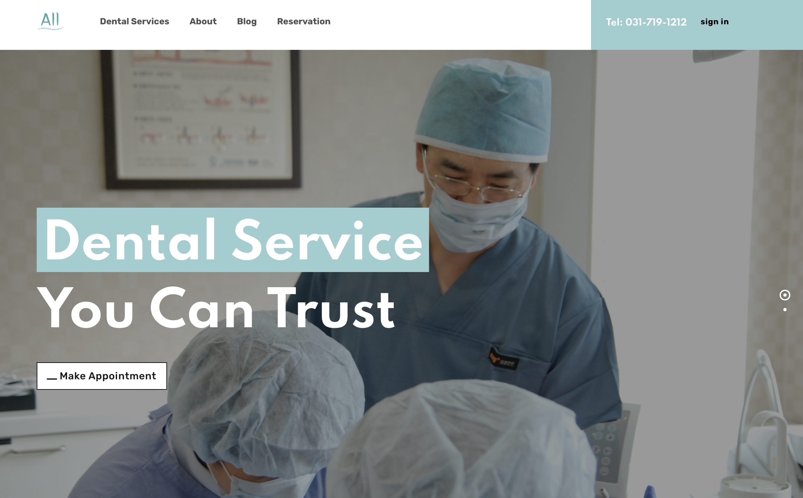
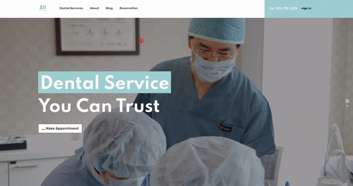

# Dental Clinic Website and Reservation Page

  
All Dental Clinic [website](http://alldent.kr/en) and [reservation page](http://alldent.kr/reservation)

All Dental Clinic's website and reservation page created using Java, Spring Boot, MySQL, HTML, and Mustache. Website deployed on Amazon Web Services EC2. 

- Created a cloud database using Amazon Relational Database Service. Connected the database to the local machine and cloud server and used Spring Data JPA and SQL to modify the data.
- Designed and optimized a relational database schema for patient records and appointments using MySQL
- Deployed website on Amazon EC2 and implemented zero downtime automatic deployment with Travis CI and NGINX.
- Adopted Boostrap theme [Folio – Creative Agency Portfolio Theme](https://themes.getbootstrap.com/product/folio-creative-agency-portfolio-theme/)

## Reservation Page

---
  
- Supports Google and Naver Login
- You can make a reservation and view, update, or delete it. 

  
